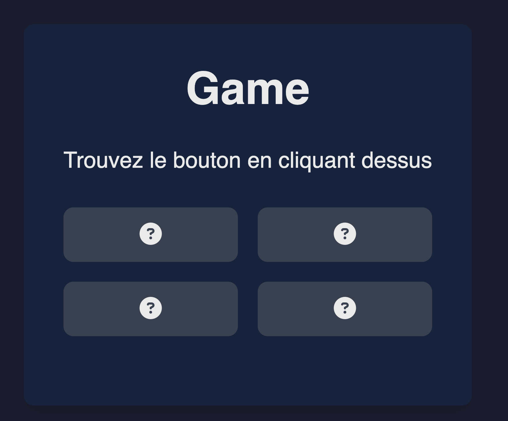
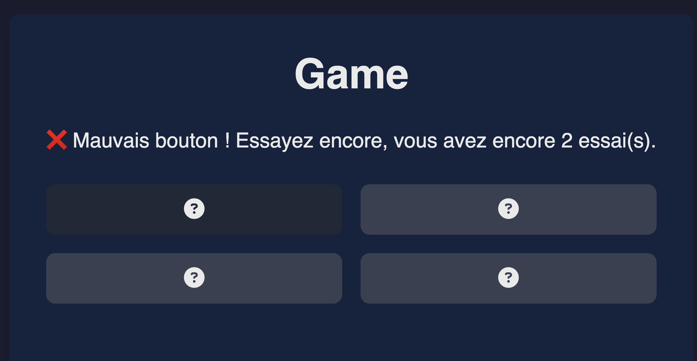
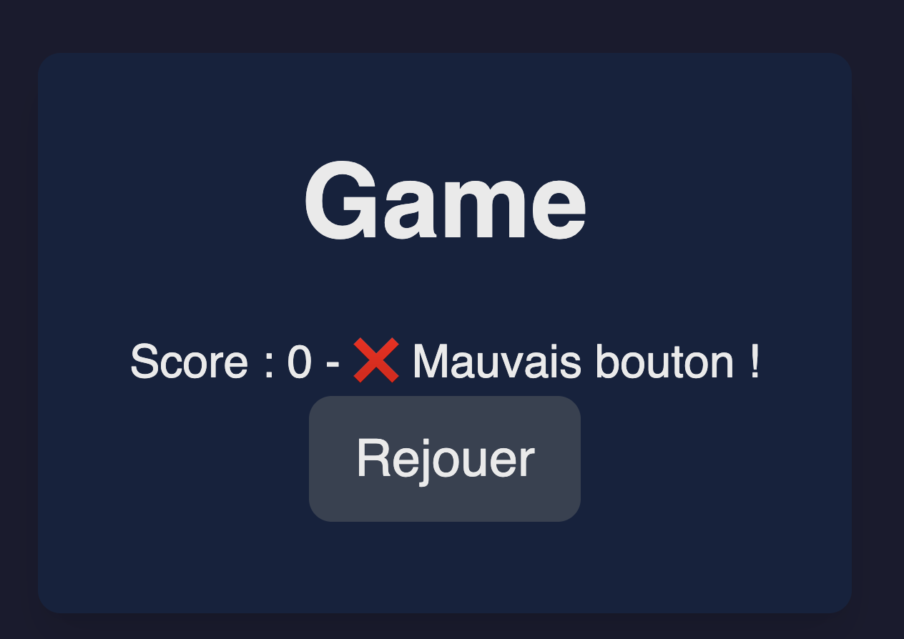
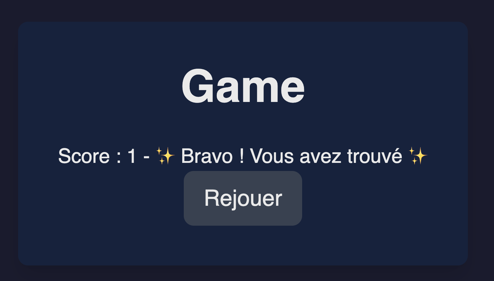

## **TP : Créez un jeu interactif avec React - "Devinez le bouton"**

Vous allez créer une application interactive où l'utilisateur devra deviner un bouton caché parmi plusieurs. 

Ce projet vous permettra de manipuler **React**, d'utiliser des états dynamiques avec **Hook useState**, et de styliser l'interface avec **Tailwind CSS** (code déjà fourni).

Utilisez le modèle : [modèle](../Models/model.html)

Voyez les wireframe à la fin du TP pour vous guider dans la réalisation du projet.

---

### **Instructions**

### **Le composant principal**

1. Créez un composant `App` qui servira de point d'entrée pour votre application. Ce composant doit afficher un titre pour le jeu.  

2. Pensez à organiser votre structure pour rendre votre code modulaire.

---

### **Affichage des boutons**

1. Ajoutez une grille contenant 4 boutons. Ces boutons doivent être affichés dynamiquement à l'aide d'une boucle (ex. : `map`).  

2. Les boutons doivent réagir à un clic en exécutant une fonction. Comment allez-vous transmettre cette fonction au bouton cliqué ?  

---

### **La logique métier**

1. Implémentez une fonction qui génère aléatoirement la position du bouton cible à chaque partie.  

2. Ajoutez un système pour vérifier si le bouton cliqué est le bon

3. Limitez le nombre d'essais de l'utilisateur (ex. : 2 essais).  

4. Identifiez les états nécessaires pour le jeu : bouton cible, nombre d'essais restants, message à afficher, etc.  

5. Réinitialisez le jeu lorsque l'utilisateur gagne ou perd.  

---

### **Ajoutez un bouton "Rejouer"**

1. Lorsque la partie se termine, affichez un bouton "Rejouer", pensez à réinitialiser les états de votre composant.

### Wireframes

